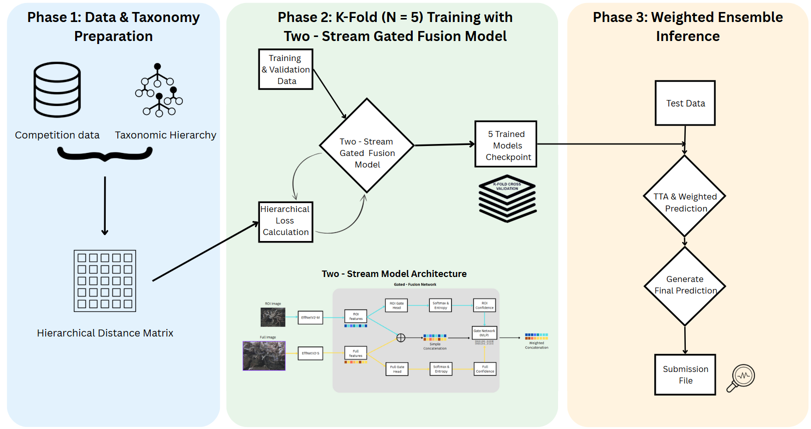
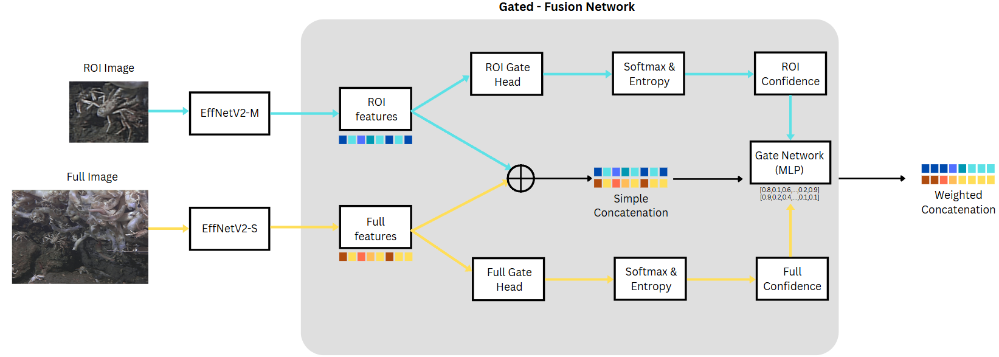

# FathomNet 2025 Competition - 2nd Place Solution

## Overview

This repository contains the code and documentation for our 2nd place solution in the FathomNet 2025 competition.

## Competition Description

The FathomNet 2025 competition challenged fine-grained hierarchical classification of marine organisms. The goal was to accurately identify species within their taxonomic context using underwater imagery.

## Our Approach




Our solution employs a multi-stage pipeline that includes:

1. **Data Preprocessing**: Images were preprocessed with various augmentations for the training set, including random cropping, flips, color jitter, and rotation, to enhance robustness. Validation and test sets underwent resizing and center cropping without aggressive augmentation. Labels were numerically encoded, and the data was split stratifiably into 80% training and 20% validation sets.
2. **Model Architecture**: The model is a two-stream hierarchical classifier. It uses EfficientNet-V2 backbones to extract features from both a detailed Region of Interest (ROI) and the full contextual image. These features are fused using an uncertainty-guided gating mechanism before being fed to a classifier head.

 

 
 
 A custom hierarchical loss is employed to incorporate taxonomic relationships.

   
L_total = L_CE + λ_h · L_h


- $\mathcal{L}_{\text{CE}}$: Cross-Entropy loss with label smoothing.
- $\mathcal{L}_h$: Hierarchical Distance Penalty — penalizes errors based on taxonomic tree distance.
- $\lambda_h$: Weight factor controlling the influence of hierarchical alignment.

This formulation helps the model optimize both accuracy and taxonomic consistency in line with the competition's evaluation metric.

3. **Training Strategy**: The training strategy involved 5-fold cross-validation using PyTorch Lightning, AdamW optimizer, and cosine annealing scheduler. Early stopping and model checkpointing optimized model selection per fold. The models was trained on 4 GPU L4 and took around ~ 8 hours.
4. **Post-processing**: Inference used a weighted ensemble of 5 models from cross-validation. Each model's predictions were enhanced with 2-view rotational Test-Time Augmentation. The final probability was computed using a weighted geometric mean for optimal performance.


## Setup and Installation

### Requirements

```bash
# Clone the repository
git clone https://github.com/kidshock/fathomnet-2025-2ndplace.git
cd fathomnet-2025-2ndplace

# Create and activate a conda environment
conda create -n fathomnet python=3.10
conda activate fathomnet

# Install dependencies
pip install -r requirements.txt
```

### Data Preparation

## Usage

### Training

## Prepare Data
Place all data (CSVs + image folders) into the data/ folder.

Ensure your train.csv has a column called full_image_path.

Run this to create the taxonomy tree and distance matrix:

 - python preprocessing/create_taxonomy_artifacts.py


## Train the Model

 - python -m src.train
 

### Inference


To simplify inference with our model weights, you can use inference_only.ipynb for inferencing with the test data from the competition (~5 minutes with  1 GPU L4) to get the submission csv file.


### Our Solution


## Results

Our solution achieved a hierarchical distance of 1.68 on the test set, placing us 2nd in the competition leaderboard.

### Performance Metrics

| Model Variant | Validation Score | Test Score |
|---------------|------------------|------------|
| Single Model  | 0.56             | 1.80       |
| Ensemble      | ----             | 1.68       |


Additional evaluation will be added soon...

## Key Insights

- Combining the full image with the ROI (Region of Interest) image significantly improves prediction performance compared to using only the ROI image. The two sources of visual information complement each other well.
- Some of the test data appears to be flawed: several ROI images do not contain any species at all and instead focus on empty areas like water or the seabed. This issue may be due to an error during the cropping process when downloading the images, or it could stem from problems in the test annotation file. 
- If I had more time, I would reimplement the model using BioCLIP or BioCLIP 2. I attempted this before, but it didn’t perform as expected. Later, I realized the issue was that I had incorrectly handled the taxonomic data :(  .I hadn't aligned it properly with the format used during BioCLIP's original training.

## Team Members
- Vu Hai Thien Long (equal contribution)
- Luu Linh Ly (equal contribution)

## Acknowledgments

- [FathomNet](https://fathomnet.org/) for organizing the competition and providing the dataset
- Laura Chrobak and Kevin Barnard. FathomNet2025. https://kaggle.com/competitions/fathomnet-2025, 2025. Kaggle.


Documented by Luu Linh Ly at ICTLab - USTH

```
